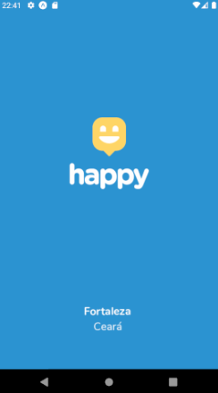

<h1 align="center">

</h1>
<h1 align="center">
    Next Level Week #3</br>
    Node.js | ReactJS | React Native | Typescript
</h1>
<hr/>
<p align="center">
  
  
   
  <br/>
  <!-- <a href="https://insomnia.rest/run/?label=nextlevelweek2&uri=https%3A%2F%2Fraw.githubusercontent.com%2FHigorSnt%2Fproffy%2Fmaster%2F.github%2FInsomnia.json" target="_blank"></a> -->
</p>

<hr/>

<h2 align="center">happy Web / happy Mobile</h2>
<h1 align="center">


</h1>

<hr/>

## :pushpin: Content

- [About](#about)
- [Technologies](#technologies)
- [How to Run](#construction_worker-how-to-run)
- [Issues](#issues)
- [Contributing](#tada-contributing)
- [License](#closed_book-license)

## About

React Native + ReactJS + NodeJS + Typescript project developed on RocketSeat NexLevelWeek #3. This project in honor of Children's Day, which is aimed at the social cause, for an application focused on concentrating the addresses of the city's Orphanages. Thus, it is possible to easily locate these entities, for the social well-being of the children who live there.

## Technologies

This project was developed with the following technologies:

- API:

  - [NodeJS](https://nodejs.org/en/)
  - [Typescript](https://www.typescriptlang.org/)
  - [ts-node-dev](https://github.com/whitecolor/ts-node-dev)
  - [Express](https://expressjs.com/)
  - [KnexJS](http://knexjs.org/)
  - [SQLite3](https://www.npmjs.com/package/sqlite3)
  - [Cors](https://www.npmjs.com/package/cors)

- Web:

  - [ReactJS](https://reactjs.org/)
  - [Typescript](https://www.typescriptlang.org/)
  - [React Router v5](https://github.com/ReactTraining/react-router)
  - [Axios](https://github.com/axios/axios)
  - [styled-components](https://styled-components.com/)

- Mobile:

  - [React Native](https://reactnative.dev/)
  - [Expo](https://expo.io/)
  - [Typescript](https://www.typescriptlang.org/)
  - [React Navigation v5](https://reactnavigation.org/)
  - [styled-components](https://styled-components.com/)
  - [Axios](https://github.com/axios/axios)

<hr/>

# :construction_worker: How to run

To clone and run this Project, you'll need Git, Node.js v14.4.0 or higher + Yarn v1.22.4 or higher installed on your computer. From your command line:

### Clone this repository

```
$ git clone https://github.com/ivanvieirace/nextlevelweek3-happy.git
```

## 📦 Run API

```bash
# Go to Backend folder
$ cd backend

# Install Dependencies
$ yarn install

# Run Application
$ yarn startserver
```

Access API at http://localhost:3333/

## 💻 Run Web Project

```bash
# Go to Web folder
$ cd web

# Install Dependencies
$ yarn install

# Run Application
$ yarn start
```

Go to http://localhost:3000/ to see the result.

## 📱 Run Mobile Project

To run the mobile project you need a cellphone with the app of [expo](https://play.google.com/store/apps/details?id=host.exp.exponent) instaled or a emulator android/ios.
<br />
After, fork this repository and clone to your machine. Inside of the project's folder run the following commands:

```bash
# Go to Mobile folder
$ cd mobile

# Install Dependencies
$ yarn install

# Run Application
$ yarn start
```

## :bug: Issues

Feel free to **file a new issue** with a respective title and description on the the [happy](https://github.com/ivanvieirace/nextlevelweek3-happy/issues) repository. If you already found a solution to your problem, **i would love to review your pull request**!

## :tada: Contributing

First of all, thank you for being interested in helping out, your time is always appreciated in every way. :100:

Here's some tips:

- Check the [issues page](https://github.com/ivanvieirace/nextlevelweek3-happy/issues) for already opened issues (or maybe even closed ones) that might already address your question/bug/feature request.
- Feature requests are welcomed! Provide some details on why it would be helpful for you and others, explain how you're using bull-board and if possible even some screenshots if you are willing to mock something!

Check out the [contributing](./CONTRIBUTING.md) page to see the best places to file issues, start discussions and begin contributing.

## :closed_book: License

This project is under the MIT license. See the [LICENSE](https://github.com/ivanvieirace/nextlevelweek3-happy/blob/master/LICENSE.md) for more information.

---

## Author


Made with :blue_heart: by Ivan Vieira 🚀.

Give a ⭐️ if this project helped you!

[](https://www.linkedin.com/in/ivanvieira/)
[](mailto:ivanjr.ce@gmail.com)
